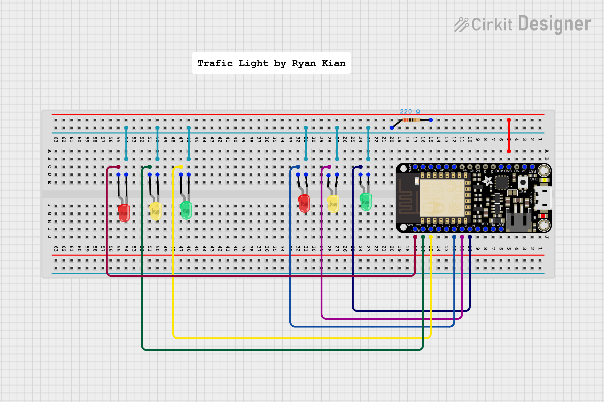

This is a traffic light simulation using feather HUZZAH ESP8266 circuit board and LEDs




arduino code

```

const int redLed1 = 15;
const int greenLed1 = 12;
const int yellowLed1 = 13;

const int redLed2 = 2;
const int greenLed2 = 4;
const int yellowLed2 = 5;

const int delayRed = 30000;
const int delayGreen = 25000;
const int delayYellow = 5000;

void setup() {
  // setup pin 5 as a digital output pin
  pinMode (redLed1, OUTPUT);
  pinMode (greenLed1, OUTPUT);
  pinMode (yellowLed1, OUTPUT);

  pinMode (redLed2, OUTPUT);
  pinMode (greenLed2, OUTPUT);
  pinMode (yellowLed2, OUTPUT);

}

void loop() {
  //light 1 green. light 2 red
  digitalWrite (redLed1,LOW);
  digitalWrite (yellowLed1, LOW);
  digitalWrite (greenLed1, HIGH);	// turn on the LED
  digitalWrite (redLed2, HIGH);
  digitalWrite (yellowLed2, LOW);
  digitalWrite (greenLed2, LOW);
  
  delay(delayGreen);	// wait for half a second or 500 milliseconds
  //light 1 yellow. light 2 red.
  digitalWrite (greenLed1, LOW);
  digitalWrite (yellowLed1, HIGH);
  digitalWrite (redLed1, LOW);	// turn off the LED
  digitalWrite (redLed2, HIGH);
  digitalWrite (yellowLed2, LOW);
  digitalWrite (greenLed2, LOW);

  delay(delayYellow);	// wait for half a second or 500 milliseconds
  //light 1 red. light 2 green
  digitalWrite (redLed1, HIGH);
  digitalWrite (yellowLed1, LOW);
  digitalWrite (greenLed1, LOW);
  digitalWrite (greenLed2, HIGH);
  digitalWrite (yellowLed2, LOW);
  digitalWrite (redLed2, LOW);

  delay(delayRed);
  //light 1 red. light 2 yellow
  digitalWrite (redLed1, HIGH);
  digitalWrite (yellowLed1, LOW);
  digitalWrite (greenLed1, LOW);
  digitalWrite (greenLed2, LOW);
  digitalWrite (yellowLed2, HIGH);
  digitalWrite (redLed2, LOW);

  delay(delayYellow);
}

```